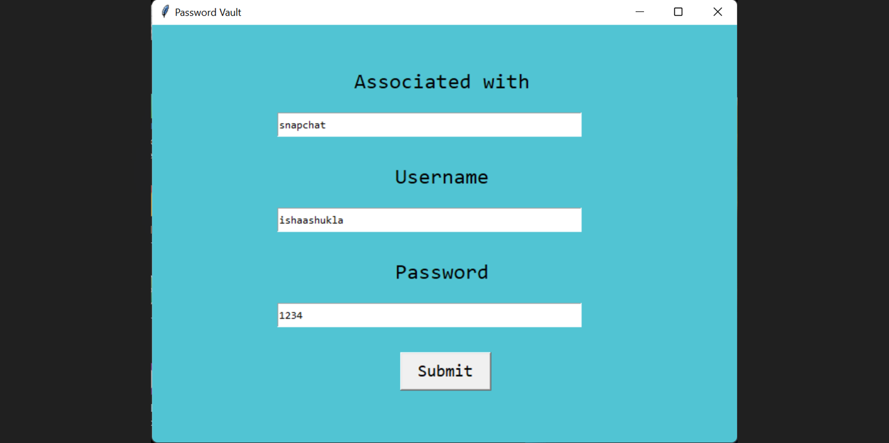
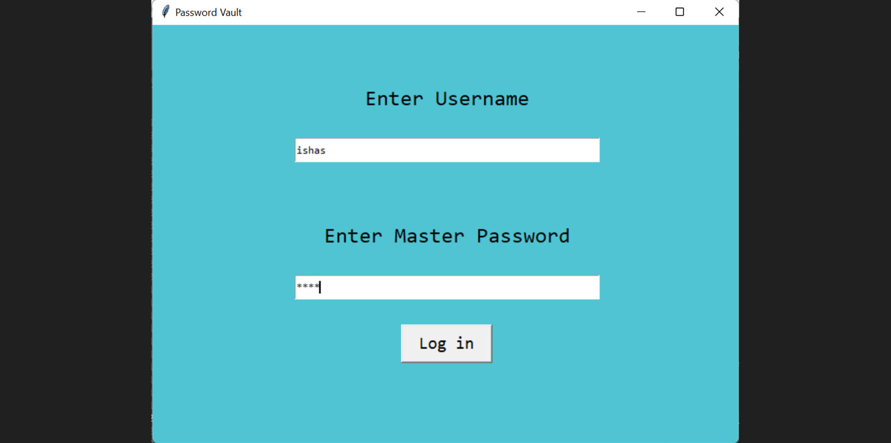
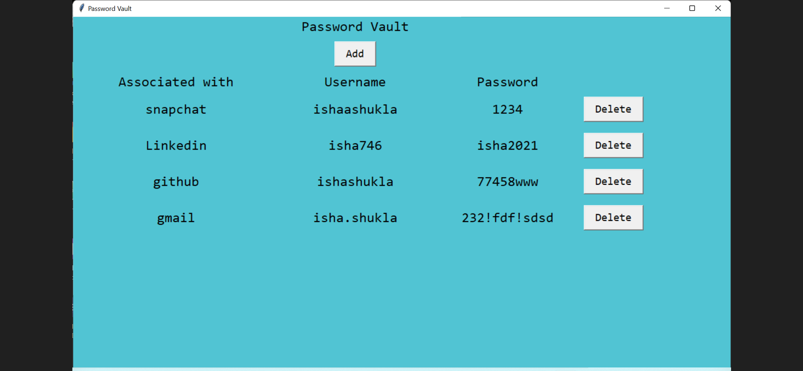

# password-vault 
* * *
## About
This is a password manager application created in Spyder using Python and its modules. It encrypts your password and user details and stores them in an SQL database file in encrypted format.

## Why you need a password manager

Password management is a crucial tool when you have any online presence. It's vital that all of your accounts online use strong and unique passwords so that they're much more difficult to break in to. Even if one of your accounts are breached, having unique passwords means that the likelihood of the attacker gaining further access to your accounts portfolio is greatly reduced.

Without a password manager, it would be very tedious to manage different passwords for each service. If you remember your passwords it's a good sign that they're not strong enough. Ideally you should memorise a primary password for your vault, and not know any of the account-specific passwords off the top of your head. 

## Precautions

Password-vault securely encrypts your data in protected files, but this security is only as strong as the weakest component - and this is very often the primary password used to lock and unlock your vault. Follow these basic guidelines to ensure that your vault is safe even if exposed: 

* Choose a unique password that is not used elsewhere
* Use a highly-varied set of different characters - such as alpha-numeric, symbols and spaces
* Use a long password - the longer the better
* Don't include words or names in the password
* Never share your password with anyone

## Features 

* Add a new account ( Multiple users possible )
* Log in to an existing account
* Add passwords
* Delete passwords

## Requirements
Make sure to have the following Python 3 dependencies installed before using the tool:
* Tkinter
* sqlite3

## Examples

### Create a new account
---

---
### Log in to an existing account
---

---
### Add passwords
---

---
### View or delete existing passwords
---

---
## What's next?
* Add a checker to check if your passwords are strong enough
* Suggest strong passwords using a function to generate random passwords with constraints
* Make encryption stronger to make vault more securely

